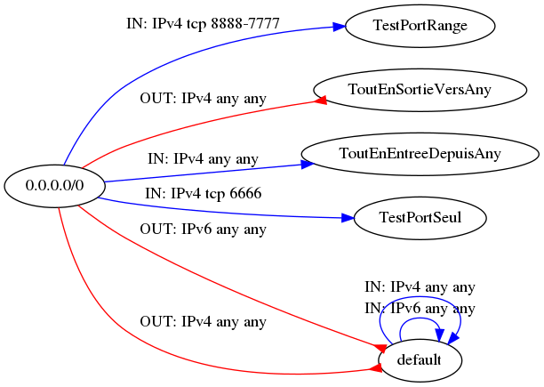
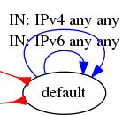
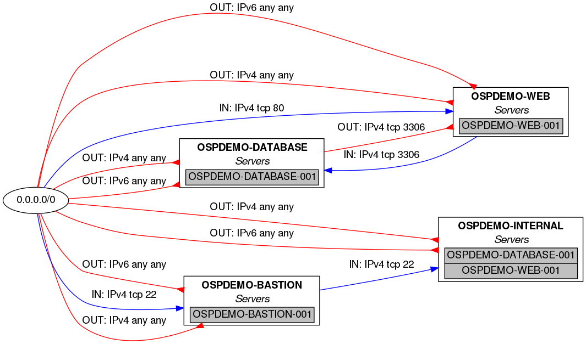
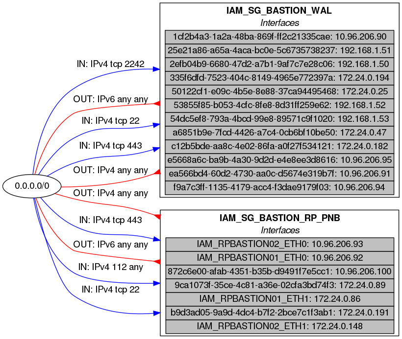
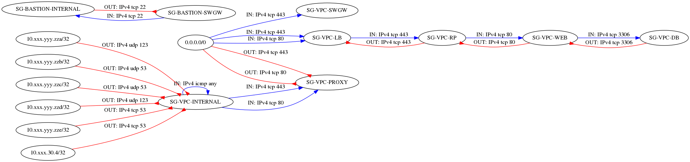

# openstack-securitygroup-grapher

This ansible role gets information from an openstack tenant and generate a [graphical representation](CloudGrapher.png) of security groups and instances through a dot file rendered by [Graphviz](https://graphviz.gitlab.io/)

## Requirements

The below requirements are needed on the host that executes this module.

* Ansible >= 2.9
* [openstack.cloud](https://docs.ansible.com/ansible/latest/collections/openstack/cloud/index.html#plugins-in-openstack-cloud) collection
* :warning: [Openstack-SDK](https://docs.openstack.org/openstacksdk/latest/user/) python library (version >= 0.12.0) needs to be installed, as that is required by the OpenStack Ansible collection.
* :warning: To render (i.e. to draw and obtain a graphic file), [Graphviz](https://graphviz.gitlab.io/) needs to be installed.

## Role Variables

|Name|Type|Description|Default|
|----|----|-----------|-------|
|`osggrapherCloudInfra`|string|Name of cloud infrastructure (defined in [clouds.yml](https://docs.openstack.org/python-openstackclient/pike/configuration/index.html)) where your tenant is. (**mandatory**)|`no default value`|
|`osggrapherShowDefault`|bool|Do you want to see default security group|`false`|
|`osggrapherShowInstances`|bool|Do you want to see instances with their security groups|`false`|
|`osggrapherShowInterfaces`|bool|Do you want to see interfaces with their security groups. Useful with instances with multiple ports with different security groups on each. Easier to read when ports have an name instead an id|`false`|
|`osggrapherShowEgressAnyAnyRules`|bool|Do you want to show egress ANY ANY rules|`true`|
|`osggrapherRankdir`|string|See <https://www.graphviz.org/doc/info/attrs.html#d:rankdir>|`LR`|
|`osggrapherDotFileToRender`|string|Path and name of generated dot file|`./CloudGrapher.dot`|
|`osggrapherFileToRender`|string|Path and name of generated image file|`./CloudGrapher.png`|
|`osggrapherRenderCsvFile`|bool|Do you want to  generate a [csv file](doc/CloudGrapher.csv) of SG and SG Rules|`false`|
|`osggrapherCsvFileToRender`|string|Path and name of generated csv file|`./CloudGrapher.csv`|
|`osggrapherRenderMdFile`|bool|Do you want to  generate a [markdown file](doc/CloudGrapher.md) of SG and SG Rules|`false`|
|`osggrapherMdFileToRender`|string|Path and name of generated markdown file|`./CloudGrapher.md`|
|`osggrapherFilter`|string|String (begin with) to filter instances and security groups name|`'no default value`|

 :point_right: If you are in a mutualized tenant, you'll probably want to filter information.

 To do that, you will have to use the `osggrapherFilter` parameter. For instance, if all your Openstack resources names begin with the same string, for instance WEB, you should probably have security groups named WEB-SG-Something, and virtual machines named WEB-SERVER-Something, then you can filter on your resources with:

 ```yaml
 osggrapherFilter: WEB
 ```

## Example Playbook

~~~yaml
---
- name: Security group grapher
  hosts: localhost
  connection: local
  gather_facts: false
  roles:
    - role: openstack-securitygroup-grapher
      osggrapherCloudInfra: MyCloud
~~~

## Examples of generated images

### How to read the graph

Ellipses are *security groups.*

The red arrows represent *egress* flows: for example, the UDP stream 53 is authorized as output of SG-VPC-INTERNAL to 10.xxx.yyy.zza.

The blue arrows represent *ingress* flows: for example, tcp stream 443 is allowed as input of SG-VPC-LB from any (0.0.0.0/0)

The arrow head is always on the security group which contains the rule represented by the arrow.

### Full example

*It shows a tenant with several security groups corresponding to the different functions of the machines present in the project.*


### Simpler example

*It shows in particular a SG that accepts any input from any source and a SG that allows any output to any destination.*



### osggrapherShowDefault

With osggrapherShowDefault: true, you'll have on your graph all the SGs, included the default Openstack SG:



### osggrapherShowInstances

With osggrapherShowInstances: true, you'll have on your graph all the instances (VM) within SGs used by these instances.



## osggrapherShowInterfaces

With osggrapherShowInterfaces: true, you'll have on your graph all the network interfaces (with their ip addresses) using each security groups.

This visualization is usefull when your instances have multiple network interfaces and you use different security group on different network interfaces.

Obviously, this visualization is easier to read when you take care to name your network interfaces with human readable names.



### osggrapherRankdir

With osggrapherRankdir: LR, left to right, RL, right to left, TB, top to bottom, BT, bottom to top, you can change the way to draw the graph.

#### LR example



#### TB example


### Author Information

Jean-Louis FEREY
